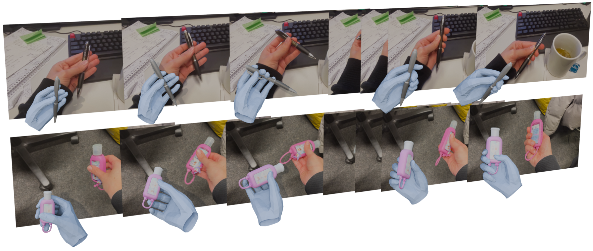
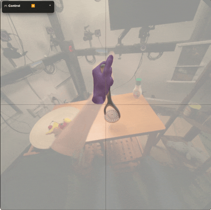

## Grasp in Gaussians (GraG): Fast Monocular Reconstruction of Dynamic Hand–Object Interactions

Official implementation of Grasp in Gaussians.

Please see more interactive examples at the [Project Page](https://aidilayce.github.io/GraG-page/). If it looks out-of-sync, refresh the page.

### Demo:

